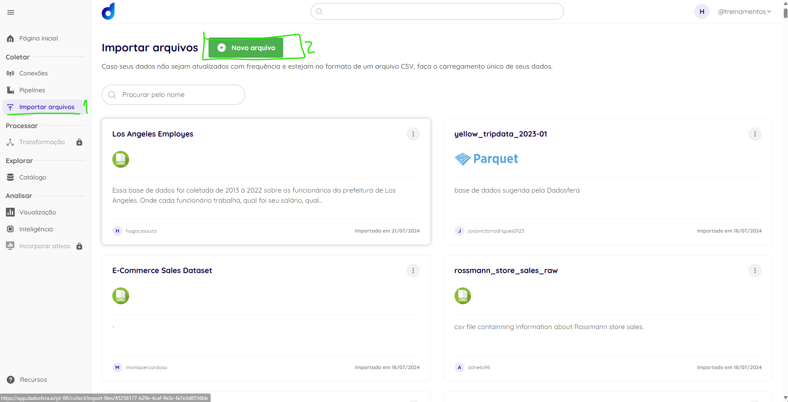
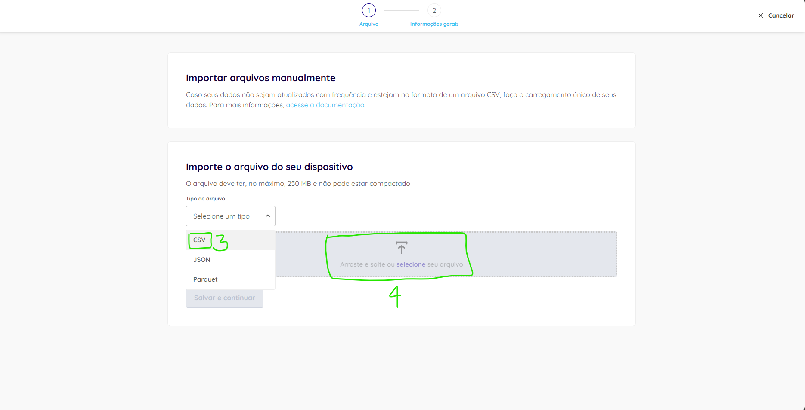
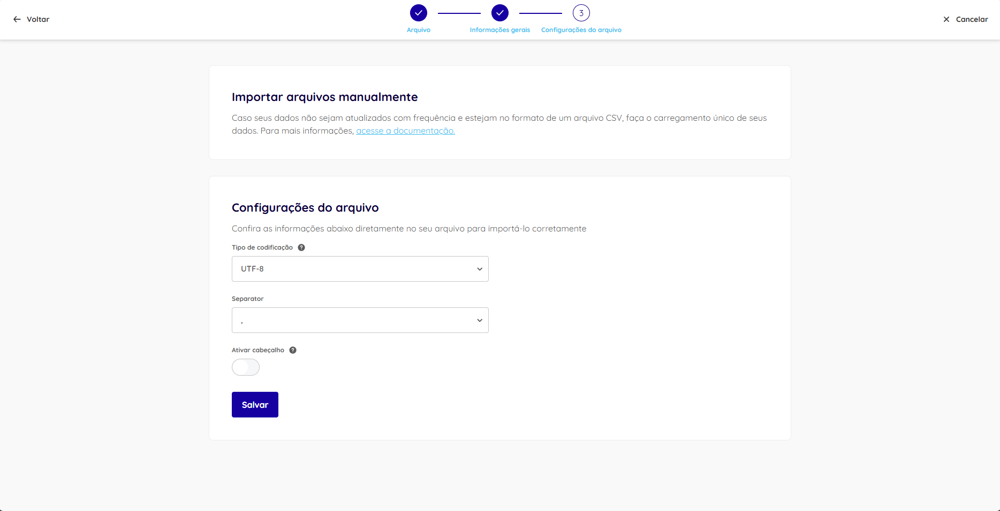
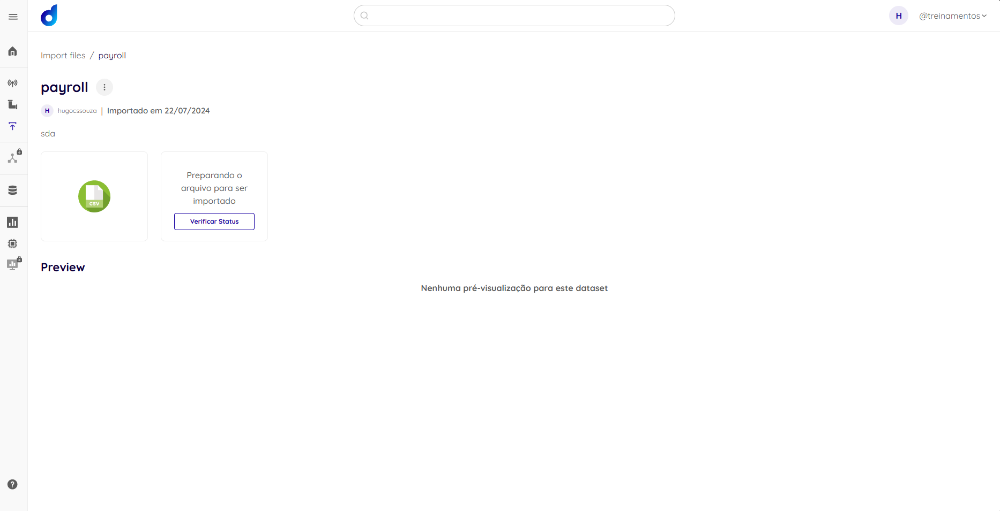

# Case Técnico Dadosfera

Apresentação do case técnico de dados para concorrer a uma vaga de Analista de Dados trainne na empresa Dadosfera.

## Objetivo

Foi enviado via email uma proposta de desafio para demonstrar os conhecimentos do candidato para disputar a vaga de Analista de Dados trainee. O desenvolvimento será apresentado neste repositório conforme informado via email.

## Proposta

Conforme aprensentado, meste desafio, uma empresa de e-commerce deseja centralizar diversas fontes de dados para melhor a tomada de decisão sobre alguma área da companhia. Para desenvolvimento deste case, será apresentada uma base de dados referente a prefeitura de los angeles, como se fosse a base de dados de uma grande empresa que possui vários setores e empregados. Esta base de dados é em relação a folha de pagamentos desde 01/2013 até 06/2023. O dataset é público e está disponível neste [link](https://www.kaggle.com/datasets/dsfelix/employees-payroll-in-los-angeles/data).

## Desenvolvimento

### Item 0 - Planejamento

Para apresentarmos uma estratégia, iremos propor à empresa o seguinte checklist:

- Analisar o salário médio da companhia
- Analisar os departamentos que tem a maior folha de pagamento
- Analisar funcioários que fazem muita hora extra

### Item 1 - Base de dados

A base de dados é referente a folha de pagamento de Los angeles do periodo de janeiro de 2013 até junho de 2022. As colunas apresentadas na base de dados são as seguintes:

- **RECORD_NBR**: Número de identificação do funcionário. Cada funcionário possui um número único. Coluna de valores numéricos;
- **PAY_YEAR**: Ano que o funcionário recebeu. Variando de 2013 á 2022. Coluna de valores numéricos;
- **DEPARTMENT_NO**: Número do departamento no sistema de folha de pagamento da cidade de Los Angeles. Variando de 2 á 98. Coluna de valores numéricos;
- **DEPARTMENT_TITLE**: Nome o departamento da cidade. Valores categóricos;
- **JOB_CLASS_PGRADE**: Coluna referente ao cargo e nível do cargo. Valores antes do hífen é a identificação do cargo e após o hífen, o nível do cargo;
- **JOB_TITLE**: Nome do cargo;
- **EMPLOYMENT_TYPE**: Carga horária do serviço, podendo ser, Full-time (Horário normal), Part-Time (Meio período) ou Per Event (Por evento);
- **JOB_STATUS**: Status do emprego no momento de registro dos dados. Assume valores apenas de ACTIVE (ativo) ou NOT_ACTIVE (não ativo);
- **MOU**: ["Memorandum of Understanding"](https://en.wikipedia.org/wiki/Memorandum_of_understanding) é um acordo que regulariza a situação trabalhista entre o empregador e os empregados;
- **MOU_TITLE**: Título do MOU, geralmente referente a que grupo o acordo está regularizando;
- **REGULAR_PAY**: Pagamento referente a horas trabalhadas normalmente;
- **OVERTIME_PAY**: Pagamento referente às horas extras;
- **ALL_OTHER_PAY**: Outros pagamentos que não são referentes as horas trabalhas ou horas extras como, bônus, vales, entre outros;
- **TOTAL_PAY**: Somatório de todos os pagamentos;
- **CITY_RETIREMENT_CONTRIBUTIONS**: Pagamentos referentes as contribuições para aposentadoria;
- **BENEFIT_PAY**: Pagamentos referentes á auxílios de vida como plano de saúde, dentário, entre outros;
- **GENDER**: Gênero autodeclarado pelo empregado. Valores categóricos;
- **ETHNICITY**: Etnia autodeclarada pelo empregado. Valores categóricos.

### Item 2 - Carregamento dos dados

Para carregamento de dados no ambiente da dadosfera, após logar, clique em "*importar arquivos*" e em "*novo*".

Nesta nova tela, selecione o tipo do arquivo (neste caso, "*csv*") e clique em selecionar seu arquivo

Coloque o nome e uma breve descrição do dataset.

Selecione as configurações do dataset, qual o delimitador, o cabeçalho e importe.

Aguarde o término de upload do arquivo. Clicando em verificar status, as informações sobre o processo irão aparecer.

### Item 3  - Catalogar os dados

A documentação deste dataset foi escrita e está disponível na plataforma da dadosfera seguindo [este link](https://app.dadosfera.ai/pt-BR/catalog/data-assets/d8aaad72-55d6-497a-a718-c4d79a0af0b8).

### Item 4 - EDA e qualidade de dados

Toda análise está feita [neste notebook](/src/notebooks/eda.ipynb).